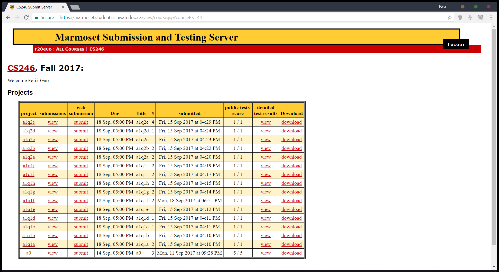

# Better Marmoset 
Better Marmoset loads the latest test run from each project, so you don't have to click into every question in order to check you've submitted something.

## Build
- `git clone https://github.com/fg123/better-marmoset.git`

To run the extension, open `chrome://extensions` and enable `Developer mode`. Then click `Load unpacked extension` and navigate to the `build` directory. The extension will then be loaded.

This extension listens for the page: `https://marmoset.student.cs.uwaterloo.ca/view/course.jsp` and then loads the necessary code required to run and display your tests alongside your project.

Original Marmoset: 

